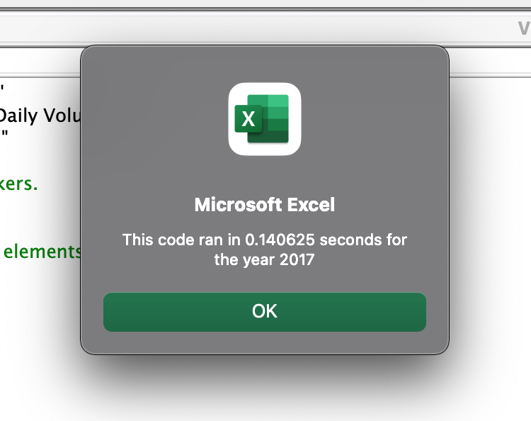
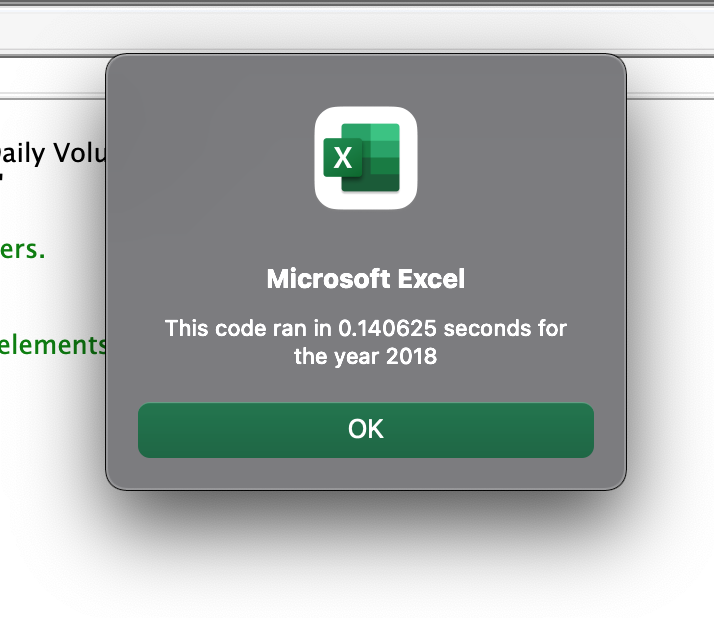

# election-analysis
This repo will contain election analysis data.
## Overview of Project
Steve, a recent finance graduate, wished to research green energy stocks to assist his parents in diversifying their investment portfolio. Initially, Steve's parents were only interested in investing in green energy stocks and had their eyes set on the stock DQ.

However, Steve now intends to use the same code to analyze the entire stock market, including more stocks than the initial sample size of 12. As a result, we refactored the initial code to reduce the run time so that we can sift through the entire stock market in a shorter length of time. This report compares the performance of green energy stocks in 2017 and 2018 and observations in the run time of newly refactored code vs. old code.

### Results
After refactoring the code, we were able to capture better insights in a fraction of the time. You can see our findings below.

## Green Stock Performance in 2017
Based on our analysis of Green Stocks in 2017, we can conclude that 2017 was an excellent year to invest in green energy stocks. We can see that 11 of the 12 stocks we looked at had a positive return. DQ was the most successful, with a return of 199.4%, despite being traded less frequently. When we first wrote our VBA script, it had a total run time of 0.63 seconds for all Stocks in 2017. However, after we refactored the code to only one for loop, we significantly reduced our run time to 0.14 seconds. This quick formula will enable us to loop through data much faster as we take on larger data sets such as the entire stock market.

You can see the exact run time for 2017 in the screenshot below:

## Green Stock Performance in 2018
In 2018, the majority of green stocks performed poorly, according to our analysis. Out of the 12 stocks we looked at, we only identified two stocks with a positive net return. 2018 was a lousy year for DQ, with a return of -62.2%. RUN was the only stock that performed well. Our first line of code took 0.66 seconds to execute; and after we refactored and committed the code, it only took 0.14 seconds to execute and return the results, making our analysis faster. We are now prepared to take on larger data sets.

You can see the exact run time for 2017 in the screenshot below:

# Summary
Based on our findings, we can conclude that refactoring the code reduced run time in both 2017 and 2018. In 2017, we reduced the run time from 0.63 seconds to 0.14 seconds, and in 2018, we reduced it from 0.66 seconds to 0.14 seconds. In general, refactoring the code improves performance, run time, and helps us understand the code better and debug quicker. 

Furthermore, in our VBA script, we used a variable tickerIndex to iterate through all of the rows and only used one for loop to run our calculations, making the code more design-friendly and faster. This will significantly assist Steve in running his code more quickly when he decides to use this code to analyze the entire stock market. 

On the downside, refactoring made the code more complex, and it may be difficult for someone to understand it fully. This can be a problem with big applications and can require a lot of additional time that may not be available in organizations who push to production on a frequent basis.
